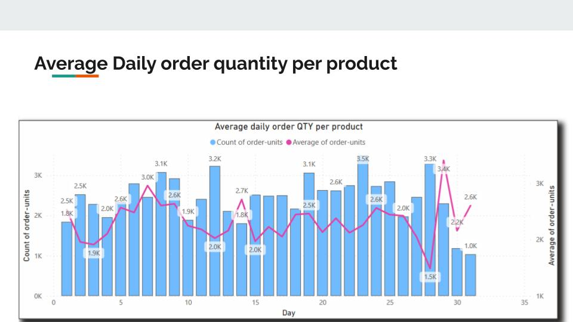
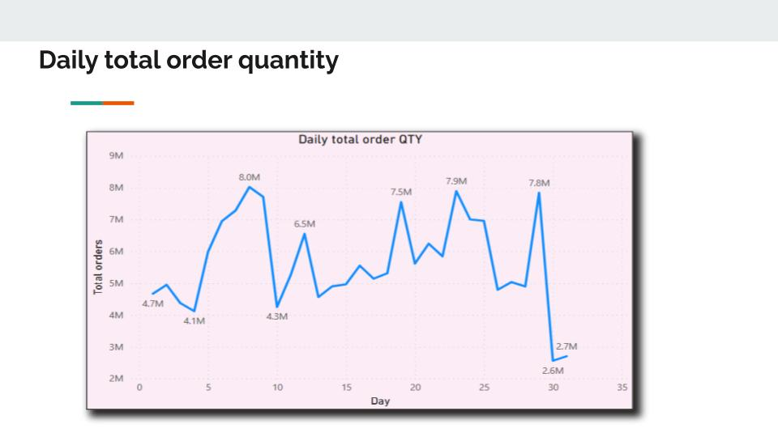
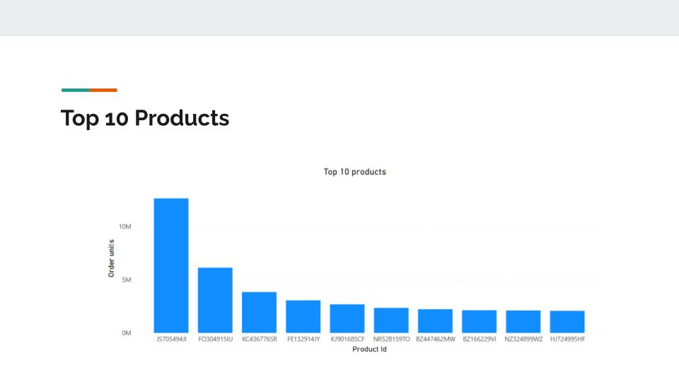
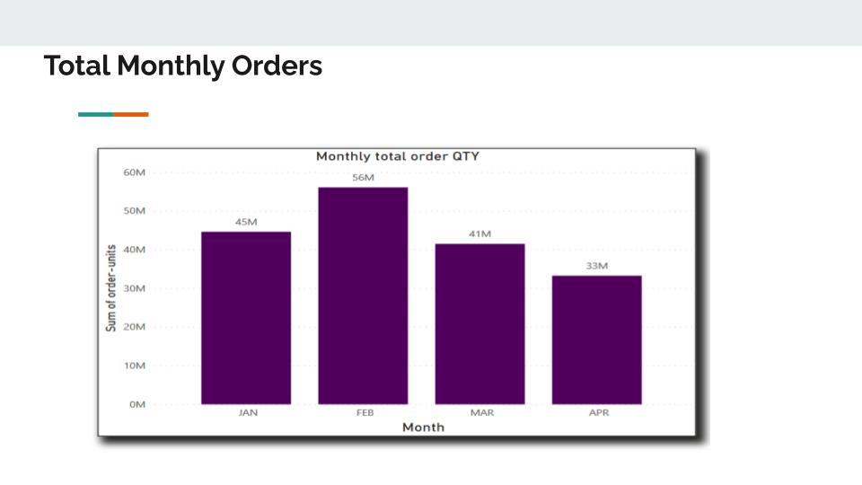

# BulkPro - Power BI Dashboard

## Problem Statement

The BulkPro management team has requested the data analyst team to look into the decline of overall orders in the Platinum category, both in terms of the number of orders and in terms of daily product quantities ordered. After analyzing key metrics such as monthly total order quantity, daily total order quantity, average daily order quantity per product, new products onboarded, and sales of new products, we have come up with some insights.

From our analysis, we observed that the monthly total order quantity and daily total order quantity showed a steady decline from January to May, with a significant drop in orders from March to April. This drop can be attributed to the COVID-19 pandemic that hit the world during the same time. The average daily order quantity per product remained relatively constant throughout the period, indicating that there was no significant change in demand for individual products in the Platinum category.

On the other hand, the number of new products onboarded showed a gradual increase from January to May, with a significant increase in May. This could be a sign that BulkPro is trying to expand its product line to attract more customers. Furthermore, the sales of new products onboarded also showed a gradual increase from January to May, with a significant increase in May, which means that customers are responding positively to the new products.

Based on our analysis, we suggest that the decline in overall orders in the Platinum category could be attributed to the COVID-19 pandemic. The management team can consider expanding the product line further, given that new products onboarded and sales of new products are showing positive growth. We have shared this report with the BulkPro management team to update them regarding key learnings.

We recommend that the management team should closely monitor the impact of the COVID-19 pandemic on sales and orders. Additionally, they should consider expanding the product line further to attract more customers. The data analyst team should continue to monitor and analyze the key metrics to identify any future trends or changes in customer behavior.

## Insights and Visualizations

### Average Daily Order Quantity per Product

### Daily Total Order Quantity

### New Products Onboarded (Daily)
.jpg)

### New Products Onboarded (Monthly)
.jpg)

### New Products Onboarded (Weekly)
.jpg)

### Sum of Order Units by Month Name and Product Source

### Top 10 Products

### Total Orders Over Google Search Keywords

### Total vs Average Order (Weekly Basis)

### Total Monthly Orders

## Usage

- **Explore Dashboards:** Interact with the data using filters, slicers, and drill-down options.
- **Analyze Data:** Review detailed reports and visualizations to uncover insights and make data-driven decisions.
- **Customize:** Modify Power BI reports and dashboards to meet your specific needs.

## Insights and Recommendations

Based on the analysis:

- The decline in overall orders in the Platinum category is likely due to the COVID-19 pandemic.
- **Recommendations for Management:**
  - Expand the product line further to attract more customers.
  - Monitor the impact of the COVID-19 pandemic on sales and orders.
  - Continue to analyze key metrics to identify future trends or changes in customer behavior.

<!-- # BulkPro - Power BI Dashboard

## Problem Statement

The BulkPro management team has requested the data analyst team to look into the decline of overall orders in the Platinum category, both in terms of the number of orders and in terms of daily product quantities ordered. After analyzing key metrics such as monthly total order quantity, daily total order quantity, average daily order quantity per product, new products onboarded, and sales of new products, we have come up with some insights.

From our analysis, we observed that the monthly total order quantity and daily total order quantity showed a steady decline from January to May, with a significant drop in orders from March to April. This drop can be attributed to the COVID-19 pandemic that hit the world during the same time. The average daily order quantity per product remained relatively constant throughout the period, indicating that there was no significant change in demand for individual products in the Platinum category.

On the other hand, the number of new products onboarded showed a gradual increase from January to May, with a significant increase in May. This could be a sign that BulkPro is trying to expand its product line to attract more customers. Furthermore, the sales of new products onboarded also showed a gradual increase from January to May, with a significant increase in May, which means that customers are responding positively to the new products.

Based on our analysis, we suggest that the decline in overall orders in the Platinum category could be attributed to the COVID-19 pandemic. The management team can consider expanding the product line further, given that new products onboarded and sales of new products are showing positive growth. We have shared this report with the BulkPro management team to update them regarding key learnings.

We recommend that the management team should closely monitor the impact of the COVID-19 pandemic on sales and orders. Additionally, they should consider expanding the product line further to attract more customers. The data analyst team should continue to monitor and analyze the key metrics to identify any future trends or changes in customer behavior.

## Usage

- **Explore Dashboards:** Interact with the data using filters, slicers, and drill-down options.
- **Analyze Data:** Review detailed reports and visualizations to uncover insights and make data-driven decisions.
- **Customize:** Modify Power BI reports and dashboards to meet your specific needs.

## Insights and Recommendations

Based on the analysis:

- The decline in overall orders in the Platinum category is likely due to the COVID-19 pandemic.
- **Recommendations for Management:**
  - Expand the product line further to attract more customers.
  - Monitor the impact of the COVID-19 pandemic on sales and orders.
  - Continue to analyze key metrics to identify future trends or changes in customer behavior. -->